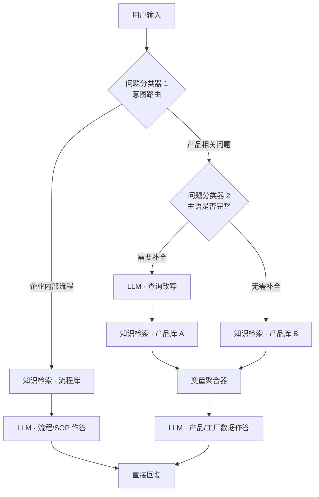

# 企业内部知识库 Agent（Dify RAG）

基于 **Dify + OpenAI** 搭建的企业内部智能问答助手，整合产品规格、成本定价、物料 BOM、SOP 操作流程、部门制度等多类型涉密资料，构建私有知识库，实现员工自助查询与新人培训提效。

> 本项目导出为 **Dify DSL**，可一键导入复用。工作流侧重**全链路工程化优化**，针对编码检索失效、长流程文档召回不足、核心数据幻觉等典型 RAG 痛点做了分层路由与检索策略设计。

---

## 解决的问题

| 痛点 | 工程化方案 |
|------|-----------|
| **内部编码/ASIN 检索失效** | 混合检索（向量 70% + 关键词 30%），提升精确编码匹配能力 |
| **口语化/省略主语导致召回失败** | 二级问题分类 + LLM 查询改写，补全「它/这款/多少钱」等模糊指代 |
| **流程类 vs 产品类文档混杂召回** | 一级意图路由 + **双知识库**隔离检索，减少跨域噪声 |
| **长流程 SOP 文档召回不全** | 流程专用知识库 + 分点作答 Prompt，保留审批人/节点/时限 |
| **成本、尺寸等核心数据幻觉** | 严格「仅引用 Context」约束，无资料时统一兜底回复 |

---

## 工作流架构



### 节点说明

1. **问题分类器 1（意图路由）**
   - **企业内部流程**：成本核算办法、入职培训、亚马逊运营指南、新品开发流程、FBA 入仓规程、来料质检 SOP、工艺规格说明书、仓储制度等
   - **产品相关问题**：产品参数、ASIN、工厂、尺寸包装、成本价目、库存台账、供应商名录、员工通讯录等

2. **问题分类器 2（主语补全判断）**（仅产品分支）
   - 识别省略主语或使用代词（「它」「这款」「多少钱」）的提问
   - 完整提问直接进入检索，模糊提问先走改写

3. **LLM 查询改写**
   - 结合对话记忆（6 轮窗口），将模糊指代替换为完整产品名 / 子 ASIN 编码
   - 输出单句精准检索 Query，提升向量与关键词双路召回命中率

4. **双知识库 + 混合检索**
   - 流程库 / 产品库分离，避免 SOP 与 BOM 互相干扰
   - `retrieval_mode: multiple`，Top-K = 4
   - 权重：向量 `text-embedding-3-small` 0.7 + 关键词 0.3

5. **变量聚合器**
   - 合并「改写后检索」与「原句检索」两路结果，统一送入生成 LLM

6. **分场景 Prompt 策略**
   - **流程类**：条理分点，保留审批人、执行人、节点时限
   - **产品类**：数字、邮箱、工厂名原样摘抄，可按需整理表格
   - **共性约束**：仅使用检索 Context，严禁编造；无匹配统一回复兜底话术

---

## 目录结构

```
.
├── README.md                          # 项目说明（本文件）
├── dsl/
│   └── 企业内部agent智能机器人.yml    # Dify 工作流 DSL，可直接导入
├── 企业内部数据/                      # AI 生成的虚拟示例知识库（见该目录 README）
│   ├── 制度性文件【虚拟数据】/        # → 绑定工作流「流程库」
│   └── 产品数据【虚拟数据】/          # → 绑定工作流「产品库」
├── web/                               # Netlify 在线体验页（静态前端）
├── netlify/functions/                 # Dify API 代理（保护 API Key）
├── netlify.toml
└── .gitignore
```

> **示例数据说明**：[`企业内部数据/`](./企业内部数据/) 内所有 docx / xlsx 均为 **AI 生成的虚构示例**，子目录已标注 **【虚拟数据】**；公司名、产品、ASIN、成本、联系人等皆非真实数据，仅供演示与知识库导入练习。

---

## 快速开始

### 前置条件

- 已部署 [Dify](https://github.com/langgenius/dify)（Cloud 或自托管均可）
- 已配置 **OpenAI** 模型凭证（工作流默认使用 `gpt-4.1` / `gpt-5.5`、`text-embedding-3-small`）
- 已准备企业内部文档并完成切片入库（建议按「流程库」「产品库」拆分；也可直接使用本仓库 [`企业内部数据/`](./企业内部数据/) 中的 **AI 虚拟示例** 快速体验）

### Dify 一键导入

1. 登录 Dify 控制台，进入 **工作室（Studio）**
2. 点击左上角 **「创建应用」** → 选择 **「导入 DSL 文件」**
3. 上传本仓库中的 [`dsl/企业内部agent智能机器人.yml`](./dsl/企业内部agent智能机器人.yml)
4. 导入完成后，打开工作流画布，检查节点是否正常加载

> **Dify 版本建议**：DSL 版本 `0.6.0`，建议使用 Dify **1.x** 及以上版本导入。

### 导入后必做配置

DSL 中的 `dataset_ids` 绑定的是导出环境的知识库 ID，**导入到你的 Dify 实例后需要重新关联**：

| 节点 | 用途 | 操作 |
|------|------|------|
| **知识检索 (2)** | 企业内部流程文档 | 重新选择你的「流程/SOP」知识库 |
| **知识检索 / 知识检索 (1)** | 产品、工厂、价目、通讯录等 | 重新选择你的「产品/工厂」知识库 |

步骤：点击对应「知识检索」节点 → **知识库** 下拉框 → 选择本地已创建的数据集 → 保存。

### 使用仓库自带示例数据（推荐首次体验）

1. 在 Dify **知识库** 新建两个数据集：**流程库**、**产品库**
2. 将 [`企业内部数据/制度性文件【虚拟数据】/`](./企业内部数据/制度性文件【虚拟数据】/) 下 8 个 docx 上传至 **流程库**
3. 将 [`企业内部数据/产品数据【虚拟数据】/`](./企业内部数据/产品数据【虚拟数据】/) 下 3 个 xlsx 上传至 **产品库**
4. 按上表绑定工作流中的知识检索节点

> 示例数据均为 AI 生成的虚构内容，详见 [`企业内部数据/README.md`](./企业内部数据/README.md)。

### 模型与插件

- 依赖 Marketplace 插件：`langgenius/openai`
- 可在各 LLM 节点按需替换为其他兼容模型（建议保留较低 temperature 的分类器节点配置）

### 发布与使用

1. 工作流调试通过后，点击 **「发布」**
2. 在「访问 API」或「嵌入网站」中获取对话入口
3. 建议开启 **引用来源（retriever_resource）**，便于员工核对原文档

### 在线体验页（Netlify 部署）

本仓库包含可部署的 **Web 体验页**，访客可在浏览器中直接与已发布的 Dify 工作流对话。

**在线地址**：https://dify-enterprise-knowledge-agent.netlify.app

#### 部署步骤

1. Fork / Clone 本仓库，并在 [Netlify](https://www.netlify.com/) 新建站点 → **Import from Git** → 选择本仓库
2. 构建设置使用默认即可（`netlify.toml` 已配置：`publish = web`，`functions = netlify/functions`）
3. 在 Netlify **Site configuration → Environment variables** 中配置：

| 变量 | 必填 | 说明 |
|------|------|------|
| `DIFY_API_KEY` | 是* | Dify 应用 API Key（发布 → API 访问 → 创建） |
| `DIFY_API_BASE` | 否 | 默认 `https://api.dify.ai/v1`；自托管请改为你的域名 |
| `DIFY_APP_NAME` | 否 | 页面标题，默认「企业内部知识库 Agent」 |
| `DIFY_EMBED_URL` | 否 | 若使用 Dify WebApp 嵌入链接，设置后将优先 iframe 模式 |

\* 与 `DIFY_EMBED_URL` 二选一

4. 重新部署（Deploy site）后即可对外分享链接

本地预览：

```bash
cp .env.example .env   # 填入 DIFY_API_KEY
netlify dev            # http://localhost:8888
```

---

## 推荐使用方式

### 知识库拆分建议

| 知识库 | 建议文档类型 | 切片策略提示 |
|--------|-------------|-------------|
| 流程库 | SOP、制度、审批流程、培训手册 | 按章节/步骤切分，保留标题层级 |
| 产品库 | 规格书、BOM、价目表、供应商名录 | 按 SKU/ASIN/产品行切分，保留编码字段 |

### 典型提问示例

**流程类**
- 「新品开发上线流程的审批节点有哪些？」
- 「FBA 入仓发货作业规程里质检标准是什么？」

**产品类（完整主语）**
- 「UT-BAG-001 的外箱尺寸和 MOQ 是多少？」
- 「XX 工厂的联系人邮箱是什么？」

**产品类（需改写补全，依赖多轮记忆）**
- 第一轮：「UT 旅行包 A 款的成本是多少？」
- 第二轮：「它的 ASIN 呢？」→ 工作流自动补全主语后检索

---

## 可复用与二次开发

本 DSL 采用**意图路由 + 查询改写 + 双库检索 + 防幻觉 Prompt** 的通用范式，可快速迁移到其他行业内部知识场景：

- 替换分类器标签与描述 → 适配法务、HR、IT 运维等域
- 增减知识库节点 → 扩展为多库（如「财务库」「合规库」）
- 调整 `top_k` 与向量/关键词权重 → 按文档类型调优召回
- 修改 System Prompt 兜底话术 → 对接企业统一回复规范

欢迎 Fork 后按业务定制，也欢迎 Issue 交流 RAG 调优经验。

---

## 技术栈

- **编排平台**：[Dify](https://dify.ai)
- **大模型**：OpenAI GPT-4.1 / GPT-5.5
- **Embedding**：text-embedding-3-small
- **检索策略**：Hybrid（Vector + Keyword）Multi-retrieval

---

## 免责声明

- 本仓库工作流 DSL 与 [`企业内部数据/`](./企业内部数据/) 示例文档均可公开复用；**示例文档为 AI 生成的虚拟数据，不含真实企业信息**
- 若在生产环境使用，请替换为经授权的真实内部文档，并符合公司信息安全政策
- 生产环境务必做好权限控制、审计日志与 API Key 管理

---

## License

MIT
